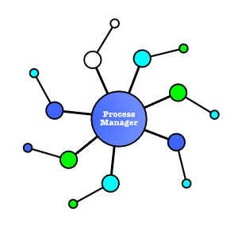

# PM2 for Electron

## The Problem

In [our current project](http://everlife.ai) we want to run multiple microservices. Each microservice is an independent, isolated, process. However, as there are a dozen of these processes we cannot expect the user to start them up manually.

### Enter PM2

There exists a solution for this problem - we use our own "Process Manager" and, once the user launches the main process, we launch all the other microservices needed.

In fact, a "Process Manager" called [PM2](http://pm2.keymetrics.io/) exists that does exactly this and which is robust, well designed and tested.

However this has two issues:

1. Electron has an internal filesystem format called [ASAR](https://github.com/electron/asar) which improves the performance of Electron apps. PM2 is unable to work with this format.
2. Electron distributes it's own (embedded) NodeJS. However, PM2 ignores this and requires the end user to install another version of NodeJS.

### The Solution

This new "Process Manager" - a simple replacement that can handle starting and managing other processes using the native NodeJS [child\_process](https://nodejs.org/api/child_process.html) module. Using the native NodeJS allows us to both link up to the embedded node in Electron and access the ASAR format.

## Interface



### The Interface

```javascript
const pm = require('elife/pm')

pm.start({

	name:'service1',

	script:'index.js',

	cwd:'./services/first',

	log: 'logs/service1.log',`

	restartAt: [0,100,500..],`

})

...

pm.stop({ name: 'service1' })

...

pm.stopall()

...

pm.restart({ name: 'service1' })

...

/* the 'on stopping event' is called when the process is exiting
 * and gives the user an opportunity to cleanly stop the microservices
 * or web servers that are running (sub processes will be automatically
 * terminated
 */
pm.onstopping(() => {
})
```

## Clean Shutdowns

### The Problem

When the main process stops, we need to  shutdown the child processes as well. Otherwise they will just remain alive and the next time we start we will launch another whole set of microservices for no reason -  all of which will compete for the same ports and resources.

### The Solution

Whenever the process stops, we will attempt to stop all the child processes we have spawned. We will do this in two ways:

1. First we will attempt to be _nice_ and send a message to each child process requesting it to shut down. If the child process has added a `pm.onstopping` handler - that will be called.
2. If the child process refuses to stop after a short while (200ms?) we will send it a SIGKILL which will, hopefully, finish it off.

## Crashing & Restarts


### The Problem

When a process encounters a problem, sometimes it "crashes" - dies unexpectedly. If a user started the process he will often be informed with some pop up and can choose to restart the process again. However, because the user has not started our processes, if they crash we need to restart them ourselves.

#### Instability

Now if the user restarts a process and it crashes again and again and again, he is likely to give up (or at least try again after a long time). However, if we automatically restart processes that are unstable (for whatever reason) we can easily reach a crash/restart spinning loop.

### The Solution

When a process crashes we will restart it. However the number of times we will restart should depend on how stable we see it behaving:

- First crash? Restart Immediately
- Crashed again? Wait 100ms before restarting
- Crashed again? Wait 500ms before restarting
- Crashed again? Wait 1 second, then 10 seconds, then 30 seconds, then 1 minute, then 5 minutes before restarting
- Still crashing? Re-try every 15 minutes

If it has been running successfully for 30 minutes before crashing, treat it as the first crash and restart the cycle again.

(this can be configured using the `restartAt:[]` parameter)

## Logging

### The Problem

In order to see what happened to the child processes, the "Process Manager" must capture all the output of the child process and redirect it to a log file.

Logging suffers from two problems:

1. Writing to log file should be batched otherwise it will slow the process down
2. Logs for multiple processes can be interleaved in the same file. They should not mix each other up

### The Solution

We will solve _both_ the above problems by batching the output and error data into _lines_ and output-ting each _line_ to the log file.

## Identity

### Named Processes

Note that we use a `name` for each process launched in order to perform further actions on it (stopping/restarting).

The `name` is not mandatory and can be duplicated. If not provided, the process will be started but you cannot ask it to restart or stop. If duplicate then the requested action will be applied to all services with matching `name`.

## API Details

### Node Processes

We use [`child_process.fork`](https://nodejs.org/api/child_process.html#child_process_child_process_fork_modulepath_args_options) to launch the process. This special case allows us to use the embedded NodeJS that comes with Electron and also to use the files in the packed ASAR format.

Because we use [`child_process.fork`](https://nodejs.org/api/child_process.html#child_process_child_process_fork_modulepath_args_options) we also can pass messages to the child process. We use this to inform the child process that we are going to shut down (so it can invoke the `onstopping` hook) before attempting to shut it down forcefully.

### Python Processes

For python programs that are embedded in the application we

(a) cannot use ASAR and

(b) need to launch a python app

Hence we should use the [asarUnpack](https://www.electron.build/configuration/configuration#configuration-asarUnpack) option to extract the python files and then launch the extracted files using [`child_process.spawn('python',...)`](https://nodejs.org/api/child_process.html#child_process_child_process_spawn_command_args_options)

## TODO
[ ] Add Support for more process types (besides just python and node)
